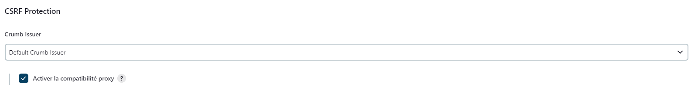

# _🖥️ CI_CD Docker (Jenkins - Prometheus - Grafana )_

## 📚 _Description_

  I have made a pipeline where I put a simple script in Jenkins ( Hello-World ) to produce metrics, after that with Prometheus and some plugins, I get all the data needed to send to Grafana.
  
Grafana will make grafics, dashboard and so on, to have a better understanding of the data.

Everythings is under Docker 🐋, I have containerize all the services by using docker-compose who help me to manage multiple containers easily.

  

## 🛠️ _Requirements_
  - 🐋 Docker on your host machine

## 🖱️ _Installation_

You have to execute inside the same folder of the _docker-compose.yml_, the docker-compose with the command: `sudo docker compose up -d` 
It will build the docker compose and create every containers of each services that are present inside the '_docker-compose.yml_' 
the '-d' is for _detached mode_ in docker, it will run all the containers in the background

  **After the command you will have access to differents webpages:**
  
  | Service     |     URL                          |
  | ----------- | -------------------------------- |
  | Jenkins     | http://localhost:8080            |
  | Prometheus  | http://localhost:9090            |
  | Grafana     | http://localhost:3000            |
  | Metrics     | http://localhost:8080/prometheus |

### _Jenkins Configurations_

Now you have access to Jenkins, you have to configure it. 
First connect to the page, it will ask for a password, you can have it by looking in the logs of the jenkins containers with these commands:  

  - `sudo docker ps` to see all the containers running, you need to get the _'Container ID'_ of Jenkins.
  - `sudo docker logs ['Container ID of Jenkins']` you will see the Jenkins password for the web page, copy and paste it in webpage

After the Jenkins's installation, you have to install a 'Prometheus plugins' call '_Promtheus Metric Exporter_'.

You will probably have to restart the container, I do `sudo docker compose stop` and `sudo docker compose up -d`

After that go back to Jenkins, you need to confirm in the System part, that Prometheus appear, if in the path there is _'\prometheus'_ so everything is good.

Create a simple pipeline with a Hello-world script to build for testing purpose.

### _Prometheus_

In Prometheus, you just have to check if the target is up, you can see that in '_status_' and '_targets_'.

### _Grafana_

You have to create your own grafics by adding a data source Prometheus, just add the good URL in the configuration of the data source.

### _ERRORS_

If you have trouble during the installation, here some things that occurs during the project:

  * Proxy errors that block you to do configuration, script and so on... You have to enable the CRSF proxy compatibility in the security settings

  

