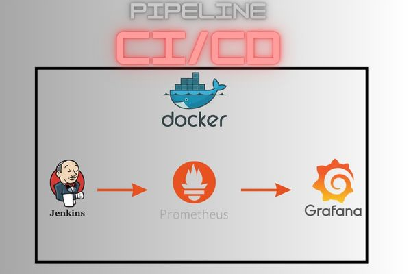

# _🖥️ CI_CD Docker (Jenkins - Prometheus - Grafana )_

## Description
I have made a pipeline where I put a simple script in Jenkins ( Hello-World ) to produce metrics, after that with Prometheus and some plugins, I get all the data needed to send to Grafana who is going to made Grafics, dashboard with it.

## Requirements
  - Docker on your host machine
